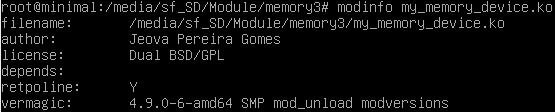
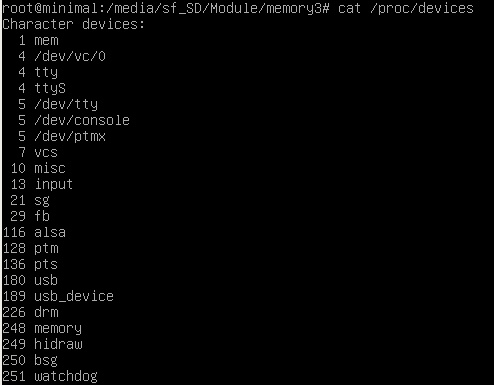
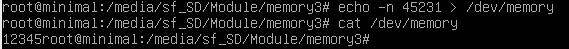

##### Autor: Jeova Pereira Gomes

## Desenvolvimento de um módulo para o kernel do Linux

Foi criado um módulo do linux que ordena 5 elementos enviados a ele mesmo.

###Informações

* Para a ordenação, foi utilizado a função `sort` do `linux/sort.h`
* O módulo foi testado na distro **GNU/Linux Debian 9** com **kernel versão: 4.9.0-6-amd64**
* Foram feitos vários scripts:
  * `compilar.sh`
    * Compila o codigo do módulo, gerando o `my_memory_device.ko`
  * `instalar.sh`
    * Remove o módulo obsoleto
    * Insere o módulo no kernel
    * Remove o `node` obsoleto do `/dev/`
    * Captura o _Major number_
    * Cria o `node` no `/dev/` com o _Major number_ capturado
  * `testar.sh`
    * Compila o módulo
    * Instala o módulo
    * Roda uma série de 3 testes

#### Observação

Utilize o `sh` para executar os scripts.

Ex.: `sh testar.sh`

##### `modinfo` do módulo:

##### `/proc/devices`, o dispositivo está com o _Major number_ dinâmico. Na captura abaixo, 248 é o _Major number_:

##### Executando:

